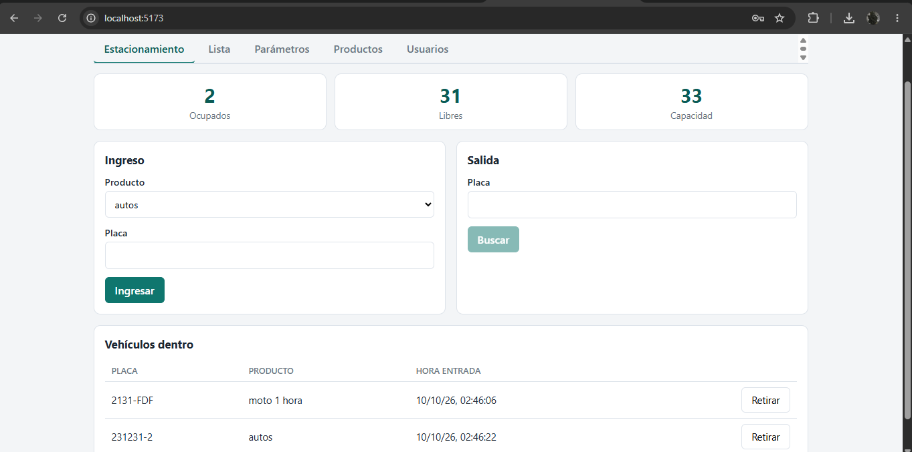
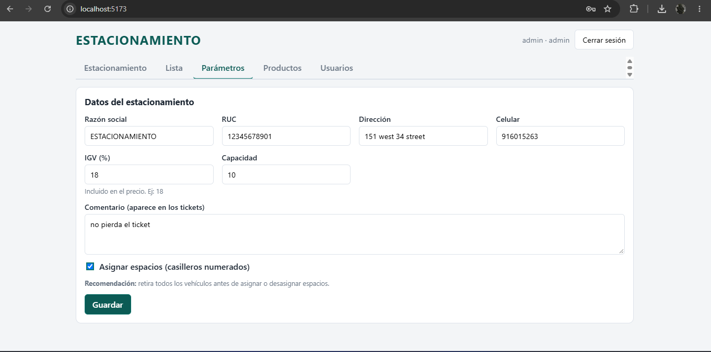
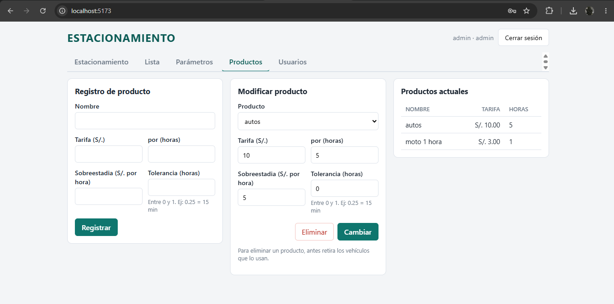
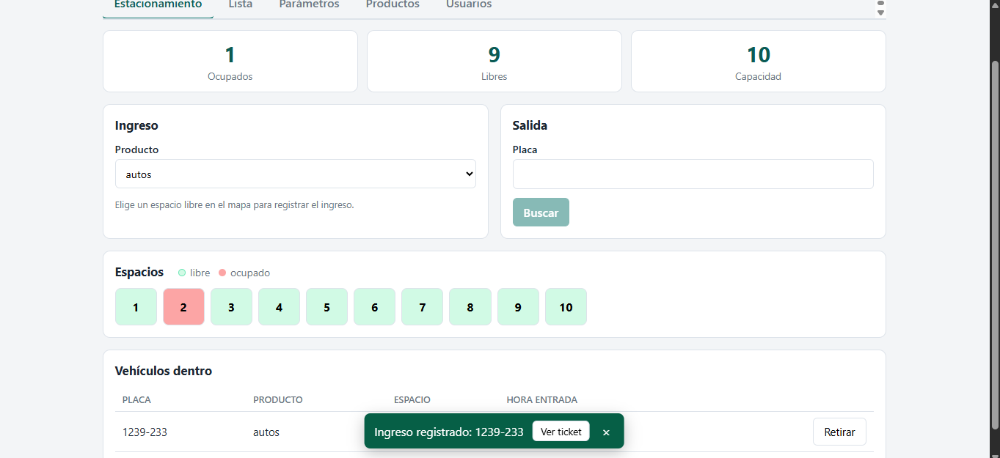
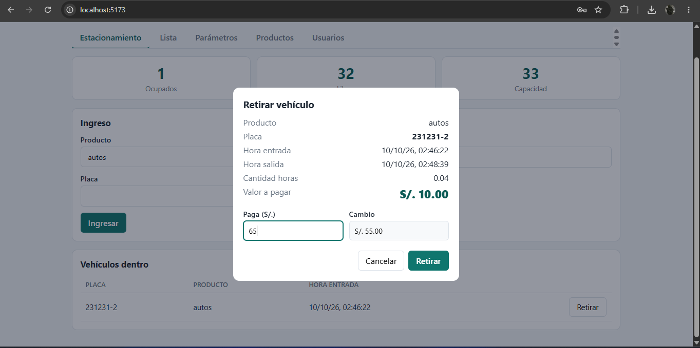

# Wulfpark Web

Migración del sistema de estacionamiento **NakPark** (Java Swing + MySQL) a una aplicación web:

| Antes | Ahora |
|---|---|
| Java Swing (`_ventana.java`) | **React** (Vite) |
| `_db.java` con JDBC | **Node.js + Express** (API REST) |
| MySQL (WampServer) | **PostgreSQL** |
| PDFs en `C:/reportes/reporte.pdf` (iText) | PDFs generados por el servidor (PDFKit) y abiertos en el navegador |
| Excel `.xls` (Apache POI) | Excel `.xlsx` (ExcelJS) |

## Requisitos

- **Node.js 20 o superior** → https://nodejs.org
- **PostgreSQL 14 o superior** → https://www.postgresql.org/download/

## Instalación (paso a paso)

### 1. Crear la base de datos

Abre `psql` (o pgAdmin → Query Tool) con el usuario `postgres` y ejecuta:

NAK por nostalgia a rakion xDDDD
```sql
CREATE USER nakpark WITH PASSWORD 'nakpark123';
CREATE DATABASE nakpark OWNER nakpark;
```

### 2. Backend (API)

```bash
cd backend
cp .env.example .env        # en Windows (cmd): copy .env.example .env
npm install
npm run db:init             # crea tablas, datos iniciales y el usuario admin
npm run dev                 # API en http://localhost:4000
```

Edita `backend/.env` si tu usuario/clave de PostgreSQL son otros (`DATABASE_URL`) y **cambia `JWT_SECRET` y `ADMIN_PASSWORD`**.

### 3. Frontend (en otra terminal)

```bash
cd frontend
npm install
npm run dev                 # abre http://localhost:5173
```

Ingresa con **admin / admin123** (o lo que pusiste en `ADMIN_PASSWORD`) y crea más usuarios en la pestaña *Usuarios*.

### 4. Producción (un solo proceso)

```bash
cd frontend && npm install && npm run build
cd ../backend && NODE_ENV=production npm start     # Windows: set NODE_ENV=production && npm start
```

El backend sirve el frontend compilado en `http://localhost:4000`. En producción define un `JWT_SECRET` largo y usa HTTPS (por ejemplo con Nginx/Caddy delante).

### Pruebas

```bash
cd backend && npm test      # cobro (unitarias) + flujo completo de la API contra PostgreSQL
```

## Funcionalidades

- **Login** con roles `admin` y `cajero` (Parámetros, Productos y Usuarios solo para admin).
- **Estacionamiento**: contadores Ocupados / Libres, ingreso por placa (mayúsculas, máx. 8), validación de placa duplicada y de "Estacionamiento lleno".
- **Asignar espacios** (casilleros): mapa de espacios libres/ocupados; clic en libre = ingreso, clic en ocupado = salida.
- **Salida**: busca por placa o espacio, muestra horas y valor a pagar, campos **Paga / Cambio**, y genera la factura.
- **Tickets PDF** (A6) de ingreso (con código de barras Code 39) y de salida/factura.
- **Lista**: filtros por estado, producto, placa, día, rango Desde/Hasta; total de ingresos (*Reportar Ingresos*) y **Exportar Excel**.
- **Parámetros**: razón social, RUC (11), dirección, celular (9), comentario (300), IGV, capacidad, asignar espacios.
- **Productos**: registrar / modificar / eliminar, con tarifa, horas, sobreestadia y tolerancia.

  
  
  
  
  

## Mejoras 

- **Seguridad**: consultas parametrizadas (el original concatenaba SQL y era vulnerable a inyección), contraseñas con **bcrypt** (antes en texto plano), sesión con JWT, permisos por rol, límite de intentos de login.
- **Integridad**: una placa o un espacio no pueden estar "dentro" dos veces (restricción en la BD, también con ingresos simultáneos); fechas reales (`timestamptz`) en vez de texto; productos con borrado lógico para no perder el historial.
- **Usuarios**: pestaña nueva para crear usuarios, cambiar claves y eliminar.
- **Vehículos dentro**: tabla con botón *Retirar*, útil cuando no se usan casilleros.
- **Mensajes claros** en vez de `JOptionPane`, funciona en celular/tablet, sin rutas fijas de Windows (`C:/reportes`).

## Dos cambios de comportamiento (decisión consciente)

1. **Cobro dentro del bloque de horas.** En el código Swing, con un producto "S/. 10 por 3 horas", una estadía de 2.5 h cobraba `ceil(2.5) × 10 = 30`. Aquí se cobra **S/. 10 fijos por el bloque** (como dice el ticket) y, pasado el bloque + tolerancia, se suma la sobreestadia por hora o fracción. La fórmula está aislada en `backend/src/billing.js`; si prefieres el comportamiento anterior, solo hay que cambiar esa función.
2. **IGV como porcentaje (18).** Antes se guardaba como fracción y el total no cambiaba. Ahora el precio **incluye** el IGV y la factura lo desglosa en subtotal + IGV.

## Estructura

```
nakpark-web/
├── database/        schema.sql, seed.sql
├── backend/         Express + pg  (src/routes, src/billing.js, src/pdf.js, test/)
└── frontend/        React + Vite  (src/pages, src/components)
```

## API (resumen)

`POST /api/auth/login` · `GET|PUT /api/parametros` · `GET|POST|PUT|DELETE /api/productos` ·
`GET /api/estacionamiento/estado` · `POST /api/estacionamiento/ingreso` · `GET|POST /api/estacionamiento/salida` ·
`GET /api/vehiculos` · `GET /api/vehiculos/export.xlsx` · `GET /api/vehiculos/:id/ticket-entrada|ticket-salida` · `/api/usuarios`
